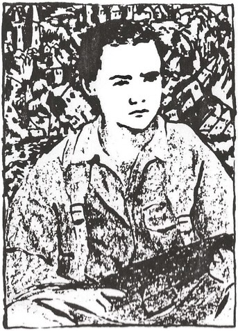

|---|---|---|
| | THE WOODEN GUN BRIGADE | |
| A WOODEN GUN IS NO GOOD FOR ANYTHING OTHER THAN POINTING  IT IS A SCULPTURE. A WORK OF ART.  REMEMBER THAT. |  | |
| | ART IS GOOD FOR POINTING.  POINTING IS THE BASIS OF COMMUNICATION.  
GETTING THE POINT ACROSS. |
| | | THE BETTER YOU CAN COMMUNICATE THE HAPPIER YOU WILL BE. ART IS IMPORTANT. LEARN TO MAKE YOUR POINT IMPORTANT. |
| LEARN TO MAKE ART. LEARN TO DEFEND ART BY MAKING ART. | | |

### The Wooden Gun Brigade

What is this?\
(Hold up wooden-gun.)\
What is this?\
(Hold up wooden bullet.)\
And what is this?\
(Touch pointed end of bullet.)

When you fire a gun and hit someone with a bullet you get your point across.\
What's the point of a bullet?\
"Drop dead.”

Do you understand?\
I am trying to get a point across.\
This gun is not to kill you but to make you more alive.\
The dead neither think nor feel.\
The more you think and feel, the more alive you are.

This gun is a work of art.\
A sculpture.\
It is also a toy.\
Part of a game.\
A game of pointing.\
"Bang bang, you're dead."\
A way of feeling powerful without having to hurt anyone.

It’s a way of releasing tension.

Now I'm going to show you how to be in two places at the same time.\
(Pick up globe.)\
This is a map.\
A map of the surface that we all live on.\
This is Liverpool.\
We are here. (Point to globe.)\
And we are here. (Point to group.)

Do you understand?

Maps are a way of being able to point at things without having to point at the things themselves.\
Words are like that too.

If I say "Look at me" you know where to look.\
If I say "Look at the earthquake" where will you look?\
Does anyone see anything in this room that looks like an earthquake?

Art is a kind of map.\
A way of being in more than one place at the same time.\
I’m here. (Point to self.)\
And I’m here. (Point to painting.)

If we look at this beach ball we get a rough idea of what the world looks like to me.\
My world.

Do you understand what I mean by that?\
Everyone’s world is different.\
Yet we all live in the same world.\
The real world.\
What is the real world.\
It is very difficult to know what they real world is like.\
It is very big and complicated.

That’s why we have to try and see what other people’s worlds are like if we want to know even just a little bit about what the real world is like.

That’s what art is for.\
It’s one of the best ways of seeing the world through the eyes of others.

Artists show what their view of the world is like by making art.

Everyone is an artist because everyone can make art.\
Their own art.\
Not many people know that.\
That’s why I am here. To tell you.\
To help you see even just a little bit what my world is like.\
And to help you show me even just a little bit what your worlds are like.\
We are going to make art together.

When we first try to ride a bicycle it seems difficult not to fall off.\
With practice it gets easier.\
That’s why someone who can already ride often teaches someone who can’t yet.\
I have been making art since I was your age.\
That’s why I am trying to give you the benefit of your experience.

Experience is important.\
We can all benefit from it.\
Right at this very moment we are benefiting from the experience that taught people how to make lightbulbs, buildings, clothes, the english language.\
But experience isn’t the only thing that is important.\
Does anyone know what the opposite of experience is?

Something that’s valuable.

Freshness.\
Newness.\
The ability to look at something and think something new about it.

That’s how discoveries are made.\
We benefit from discoveries as much as we benefit from experience.

For centuries the world looked flat to people.\
People with experience said it was flat.\
If you went to the edge you fell off.\
They didn’t know much about the world.\
But they thought they knew enough.\
They thought they were experienced enough and didn’t want anyone coming along and telling them that the world was a big ball.

My experience tell me that experience is not enough.\
That’s why I am here.\
That’s why we’re going to make art together.

I want you to make drawings for me.\
I will take them to studio in London and make a painting from them.\
When I’ve done that I’ll have them exhibited here in it Liverpool so you can come and see it.\
If you want.

But first let me tell you the story of this painting.

One of the first things I can remember looking at for any length of time as a child was this.\
It was my bedroom curtain.\
I remember gazing at the houses as I went to sleep.\
That kind experience is very important.\
It’s called formative visual experience.\
It means that you remember things even though you may not be aware that you remember them.\
They influence how look at everything.

Some years ago I was in a museum in Lisbon, Portugal.\
Here. (Point to globe.)\
While I was wandering around I remembered that I had read in book of my father’s (produce book) a poem written in 1755 by a French philosopher called Voltaire.\
It was about earthquake that had happened in Lisbon that year.\
The museum was full of pictures of Lisbon, so I looked for the room with the pictures of the earthquake.

There were no photographs in those days.\
People had to make pictures after something had happened.\
They had to try and represent the earth shaking.\
Shaking much that all the buildings were falling down.

In other words they had to use their imagination.\
The most interesting pictures it seemed me were ones where all the buildings were jumbled up.

I made a drawing (produce drawing) of one of them and used it to make the painting.

About seventy years ago a Spanish artist called Picasso invented a way of making pictures which got called Cubism. (Show Cubism book & photo of
Picasso.)\
He made pictures more interesting by jumbling them up.

How do you think that is connected with earthquakes?

About twenty years ago people worked out that the world is made of plates.\
The surface of it is made of big hard bits with cracks between them.\
There’s one here in Lisbon.\
And there’s another one here in the middle of the Atlantic.

The plate is moving this way towards Lisbon.\
Very very slowly it’s sliding like this (show with hands) underneath the next plate.\
Even though its very slow it isn't always smooth.\
It gets stuck.\
The pressure builds up.\
Until C R A C K.\
It moves.

That’s when earthquakes happen.

I grew up in Belfast. (Show on globe.)\
There was a lot of tension.\
There still is.

A lot of people wanted things to stay the way they were.\
A lot of people wanted things to change.\
It was like they were pushing against each other.\
They pushed and they pushed.\
And the tension got worse.\
Hatred and frustration grew.\
Until C R A C K.\
It started to explode.

I remember going down the street in Belfast and seeing a big ball of flame coming out of the side of a building.\
It was an explosion.\
A bomb.\
Bombs are like earthquakes, they destroy because of the energy they release and the sudden way they release it.

I saw in the museum that day that to make a picture of the earthquake of Lisbon would be a way to make a picture about Belfast without having to make a picture about Belfast.

Back in the eighteenth century Voltaire the French philosopher was always getting into trouble for his new ideas. (Show cover of Candide.)\
He disliked injustice.

Do you know what that means?\
He thought that the world would be a better place if people could learn to think in a better way.\
The best thing to do if you want to live in houses in an area where there are earthquakes is to think of a better way to build then so that they don’t fall down.

People have already learnt how to do that.

They don’t make them more rigid.\
They make them more flexible.

Remember that, it’s important.

When you are annoyed with someone, when you are frustrated, a tension builds up.\
You get angry.\
That’s when arguments happen.\
They explode.\
Like earthquakes.\
Like bombs.

And sometimes friendships are destroyed.\
People get hurt.

That’s why I’m interested in earthquakes.\
Because they happen like arguments.\
The kind of arguments that made Belfast such an unpleasant place to grow up in.\
The kind of arguments that seem to have no peaceful solution.\
No one solves them, so they explode.

Friendship is important.\
Clever people are those who can argue and remain friends.\
Stupid people are those who end up with their friendships in ruins.

What do you think this has to do with art?\
Art is very clever at releasing tension.

At the beginning of this century most of society had very rigid ideas about painting.\
Pictures had to look like what you see when you sit still and look in one direction.\
As if you were a camera.

When they man who painted this painting (show Delaroche postcard) first saw a photograph he said “From today painting is dead.”

Picasso didn’t want painting to die.\
But photography was a great shock to painters.\
So Picasso decided to make painting more flexible.\
To make it more like what you see when you move about and look in many different directions.\
That’s why he jumbled his painting up and invented Cubism.

What tension do you think was released when he did that?

Artists make art because they are compelled to make it.\
They feel a need to express themselves in a particular way.\
Each artist’s needs are different.\
It depends on the artist’s position in relation to society.\
Artists express their relationship with society.\
How they see the world.\
Their world.

Modern art is about the modern world.

At the beginning of this century the world suddenly changed.\
People could suddenly communicate more easily.\
This meant that discoveries have developed into experience much more quickly.\
This has encouraged more people to make discoveries.\
It has encouraged artists to experiment like I am doing now.

But not everyone wants the world to change.\
They don’t want to believe that it can change for the better.\
They have no love for the future.\
They mistrust it.

Many people dislike modern art.\
They don’t like it because they don’t like to understand it.\
They don’t like they way the world is changing.

People who don’t like change are rigid.\
When they have to change they suffer.

Flexible people make discoveries.\
Rigid people make laws.

Which do you like better?

